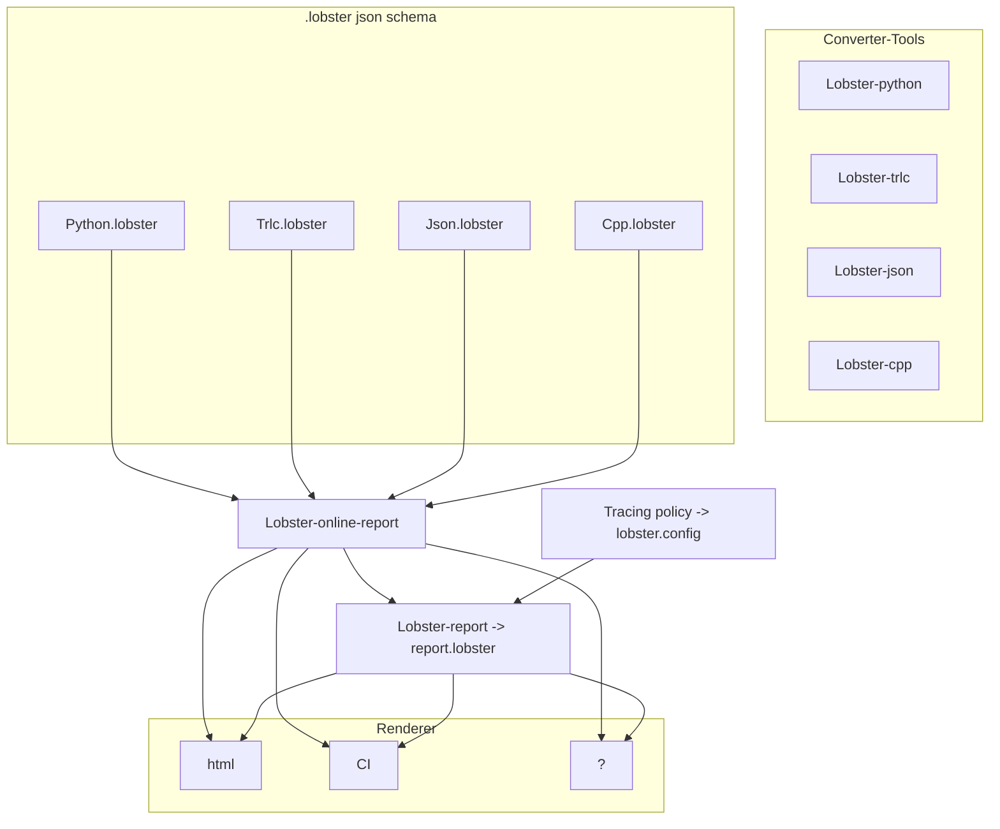

```mermaid
graph TD
    subgraph "Converter-Tools"
        A1[Lobster-python]
        A2[Lobster-trlc]
        A3[Lobster-json]
        A4[Lobster-cpp]
    end
 
    subgraph ".lobster json schema"
        B1[Python.lobster]
        B2[Trlc.lobster]
        B3[Json.lobster]
        B4[Cpp.lobster]
    end
 
    subgraph Renderer
        C1[html]
        C2[CI]
        C3["?"]
    end
 
    B1 --> D1[Lobster-online-report]
    B2 --> D1
    B3 --> D1
    B4 --> D1
 
    D1 --> C1
    D1 --> C2
    D1 --> C3
    D2[Lobster-report -> report.lobster]
    D1 --> D2
    D2 --> C1
    D2 --> C2
    D2 --> C3
    E1[Tracing policy -> lobster.config]
    E1 --> D2
```

break

graph TD;
     A-->B;
 
 break 2

```mermaid
graph TD;
     A-->B;
 ```
 